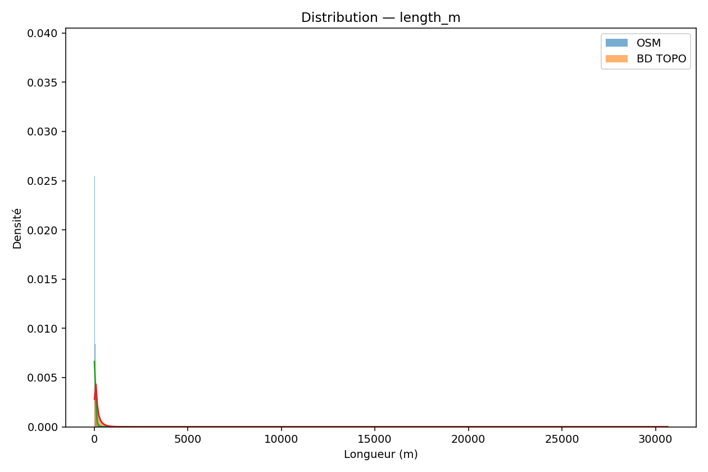
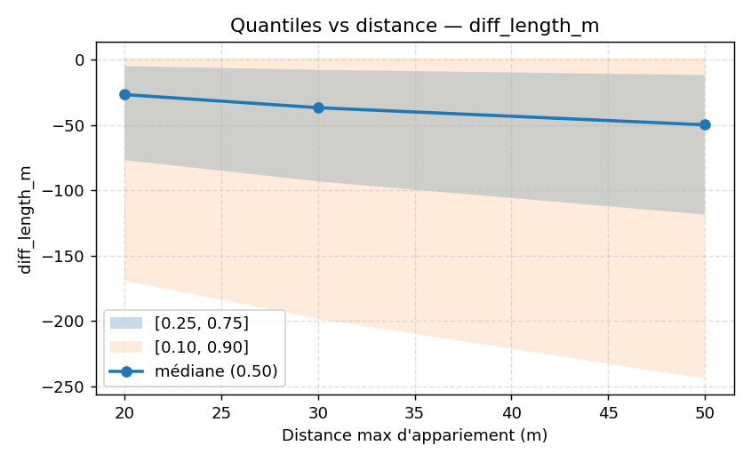

# Étude comparative de la courbure routière entre OSM et BD TOPO
## Introduction
La qualité des bases de données routières est cruciale pour les applications de simulation et de mobilité, notamment dans les domaines de la sécurité routière, de la planification urbaine et des systèmes de transport intelligents. Des données précises permettent de modéliser fidèlement les comportements des véhicules et d’optimiser les itinéraires, ce qui est essentiel pour le développement des véhicules autonomes et la gestion du trafic.

OpenStreetMap (OSM), base collaborative mondiale, offre une couverture étendue et une mise à jour fréquente, mais présente des variations de qualité selon les régions et les contributeurs. En revanche, BD TOPO, produite par l’IGN, propose une base officielle avec une qualité homogène et une méthodologie rigoureuse, mais avec un accès parfois plus restreint et un maillage plus lisse. Ces différences influencent directement les métriques routières telles que la longueur des segments, la courbure et le rayon des virages.

L’objectif de cette étude est de comparer quantitativement OSM et BD TOPO sur plusieurs métriques routières en France, afin d’évaluer leurs divergences et leurs complémentarités pour les usages de simulation et de mobilité. Cette analyse porte sur la longueur des segments, les rayons de courbure et les mesures statistiques associées, avec un focus sur les différences par classe de route et les biais potentiels liés à l’appariement spatial.

*À développer : contexte scientifique, état de l’art, enjeux pratiques.*

## Méthodes
### Jeux de données
- OSM (extraction nationale)
- BD TOPO (IGN)
### Prétraitement et appariement
Les données ont été segmentées en tronçons homogènes pour garantir une comparaison pertinente. L’appariement spatial entre OSM et BD TOPO a été réalisé à l’aide d’un KDTree optimisé, permettant de rechercher efficacement les correspondances les plus proches dans un rayon maximal de 20, 30 ou 50 mètres selon les analyses. Cette méthode assure une correspondance fine tout en limitant les erreurs dues aux décalages géographiques.

Le pipeline RS3 a été utilisé pour générer les métriques routières, incluant le calcul des longueurs, des rayons de courbure et des courbures moyennes. Ce pipeline intègre des filtres et des traitements spécifiques pour garantir la qualité des données extraites.

*Schéma du pipeline à insérer*

### Métriques étudiées
- Longueur de segment.
- Rayon minimal et rayon au 85e centile.
- Courbure moyenne.
### Analyses statistiques
- Tests statistiques : Welch t-test, Kolmogorov–Smirnov, Mann–Whitney.
- Tailles d’effet (Cohen’s d, Cliff’s delta).
- Analyses par classe de route.
- Exploration des biais (distance d’appariement, vitesses, pente).

*À compléter avec schémas, équations, détails techniques (matching, filtres, pipeline RS3).*

## Résultats
### Comparaison globale
- Différences significatives entre OSM et BD TOPO.
- Distribution des longueurs et rayons.

L’analyse globale montre que les segments OSM sont généralement plus courts que ceux de BD TOPO, ce qui traduit une segmentation plus fine dans la base collaborative. Cette fragmentation accrue peut influencer les calculs de courbure et les modèles de mobilité basés sur ces données.

### Par classe de route
- Résultats des boxplots et violon plots.
- Classes montrant des écarts systématiques (motorway, trunk, etc.).

Voir toutes les figures détaillées dans le [rapport par classe](reports/curvature_by_class.md).

Pour les autoroutes (motorway), la tendance à une segmentation plus fine dans OSM est également observée, avec des distributions de longueurs plus concentrées sur des valeurs faibles. Ces différences peuvent impacter les analyses spécifiques aux classes de routes, notamment pour la modélisation des vitesses et des comportements.

### Sensibilité à la distance d’appariement
- Impact de 20 m vs 30 m vs 50 m.
- Taux d’appariements réussis.

La sensibilité à la distance d’appariement révèle que des seuils plus larges augmentent le taux d’appariements mais peuvent introduire des biais en associant des segments non strictement correspondants. Un compromis autour de 30 mètres semble optimal pour équilibrer précision et couverture.

### Autres biais explorés
- Influence de la pente et des vitesses.

*Figure Z à insérer*

## Discussion
Les divergences observées entre OSM et BD TOPO s’expliquent en grande partie par la nature même des bases : OSM est plus fragmentée, reflétant la granularité variable des contributions collaboratives, tandis que BD TOPO présente un maillage plus lissé et homogène, issu d’une méthodologie officielle et centralisée.

Cette différence de collecte influence la qualité des métriques routières, notamment la courbure et la longueur des segments, qui sont essentielles pour les simulations de trafic et les analyses de sécurité. De plus, OSM est particulièrement riche en zones urbaines où la densité des contributeurs est élevée, tandis que BD TOPO offre une couverture plus homogène en zones rurales, limitant certains biais géographiques.

Les limites de cette étude incluent la restriction géographique à la France métropolitaine et l’utilisation de métriques simplifiées qui ne capturent pas toutes les complexités du réseau routier. Des travaux futurs pourraient étendre l’analyse à d’autres régions et intégrer des variables complémentaires comme la pente et les vitesses.

## Conclusion
Cette étude met en évidence trois points clés : d’une part, des écarts systématiques entre OSM et BD TOPO liés à la fragmentation et à la méthodologie de collecte ; d’autre part, un impact significatif de ces différences sur les métriques routières utilisées en simulation et mobilité ; enfin, la complémentarité potentielle des deux bases pour enrichir les analyses.

Ces résultats ouvrent la voie à des soumissions dans des conférences et revues spécialisées telles que le Transportation Research Board (TRB), le ITS World Congress ou la revue Data in Brief, afin de partager ces avancées avec la communauté scientifique et les praticiens du secteur.

*À finaliser : messages clés, perspectives de soumission (conférence/journal ciblé).*