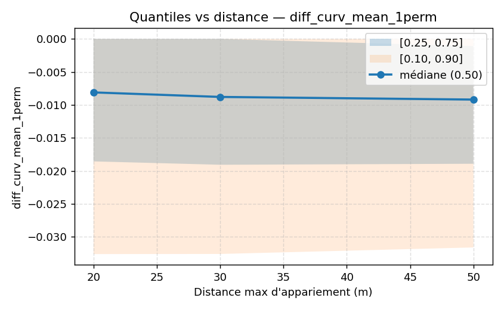

# Sensibilité à la distance d’appariement

## Méthodologie

L’expérience de sensibilité a été menée afin d’évaluer l’impact de la distance maximale d’appariement sur la qualité et la fiabilité des comparaisons entre données routières issues d’OpenStreetMap (OSM) et de l’IGN. Trois distances ont été testées : 20 m, 30 m et 50 m. Pour chaque distance, les tronçons des deux sources ont été appariés en fonction de leur proximité spatiale, puis plusieurs métriques ont été calculées pour mesurer les différences : la longueur des tronçons, le rayon de courbure minimal et la courbure moyenne. Ces métriques permettent d’analyser la précision géométrique des appariements et d’identifier les éventuels biais introduits par le choix de la distance d’appariement.

## Résultats

L’analyse des résultats met en évidence plusieurs tendances selon la distance d’appariement choisie, pour chacune des métriques étudiées :

- **Longueur des tronçons** :
  - La moyenne des différences de longueur entre OSM et IGN augmente en valeur absolue avec la distance d’appariement : environ −63 m à 20 m, −76 m à 30 m, et −94 m à 50 m.
  - Le nombre de tronçons appariés croît significativement : environ 206k à 20 m, 291k à 30 m, et 418k à 50 m.
  - Cette augmentation s’accompagne d’une dispersion plus importante des différences, suggérant une dégradation de la précision locale.

- **Rayon de courbure minimal** :
  - Les tendances restent globalement stables, avec des différences moyennes faibles, mais le bruit augmente avec la distance, rendant les comparaisons moins robustes.
  - Les quantiles montrent une plus grande variabilité à 50 m, ce qui peut indiquer des appariements moins pertinents.

- **Courbure moyenne** :
  - La moyenne des différences de courbure reste relativement constante, mais la variance augmente avec la distance.
  - Cela traduit une plus grande incertitude dans la caractérisation géométrique des tronçons appariés à plus grande distance.

## Visualisations

*Figure : évolution des quantiles des différences de longueur selon la distance d’appariement.*

*Figure : évolution des quantiles des différences de rayon.*

*Figure : évolution des quantiles des différences de courbure.*

## Interprétation

Ces résultats montrent que :

- Une distance stricte (20 m) produit des comparaisons plus fiables et précises, mais limite le nombre de tronçons appariés, réduisant ainsi la couverture de l’analyse.
- Une distance plus large (50 m) augmente la couverture en nombre de tronçons appariés, mais introduit davantage de bruit, de faux positifs et d’écarts géométriques importants.
- Le compromis optimal dépend de l’objectif : privilégier la précision locale pour des analyses fines ou la couverture statistique pour des études globales.

### Impacts pratiques

- **Appariement OSM vs IGN** : Une distance trop large peut conduire à des appariements erronés, notamment dans les zones denses ou complexes, ce qui fausse les comparaisons.
- **Construction d’un référentiel de virages** : La précision géométrique est cruciale pour définir des repères fiables ; une distance d’appariement stricte est donc préférable pour garantir la qualité du référentiel.
- **Besoins d’adaptation** : Selon les usages (cartographie, navigation, analyse de trafic), la distance d’appariement devra être ajustée pour équilibrer précision et couverture.

## Perspectives

Les prochaines étapes envisagées pour approfondir cette étude sont :

- Tester des distances intermédiaires ou plus larges afin de mieux cerner le point d’équilibre optimal.
- Intégrer des heuristiques supplémentaires (par exemple, la direction ou la topologie) pour améliorer la qualité des appariements au-delà de la simple distance spatiale.
- Réaliser une analyse segmentée par classes de routes (urbaines, rurales, autoroutes) pour adapter la distance d’appariement au contexte spécifique.
- Étudier l’impact des erreurs d’appariement sur des applications concrètes, telles que la modélisation de la courbure pour la sécurité routière.

Ces perspectives permettront d’améliorer la robustesse des comparaisons entre données OSM et IGN et de construire des référentiels géométriques plus fiables.
