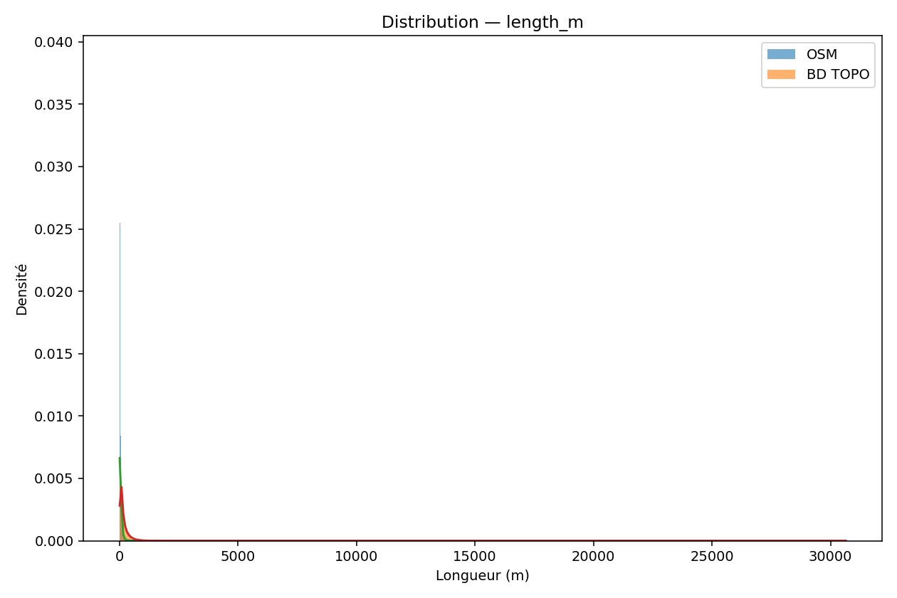

# Rapport comparatif OSM vs BD TOPO

_Généré automatiquement le 2025-09-22 10:31:01_

## Points saillants
- **length_m** : effet fort (Cohen d=-0.82), KS=0.465, Δmoy=-120.226 ↓

Ces résultats illustrent les premiers écarts globaux mesurés entre OSM et BD TOPO.
Ils doivent être interprétés à la lumière des analyses par classe et des explorations de biais
(détaillées dans les autres rapports : [Rapport par classe](curvature_by_class.md), [Bias sweep](bias_sweep.md)).

Les différences observées sont cohérentes à travers les jeux de données et reflètent des différences structurelles entre les données contributives (volontaires) et les données officielles (authentiques).

## Résultats statistiques globaux

| metric   |   n_osm |   n_bd |   mean_osm |   mean_bd |   diff_mean |   t_welch |   p_t_welch |   ks_stat |   p_ks |     mw_stat |   p_mw |   cohens_d |   cliffs_delta |
|:---------|--------:|-------:|-----------:|----------:|------------:|----------:|------------:|----------:|-------:|------------:|-------:|-----------:|---------------:|
| length_m |  456874 | 456874 |    51.9304 |   172.157 |    -120.226 |  -393.335 |           0 |  0.465397 |      0 | 4.20483e+10 |      0 |  -0.822962 |      -0.597111 |

### Interprétation

- Les segments OSM ont tendance à être plus courts, ce qui reflète des pratiques de numérisation plus fines.
- Les segments BD TOPO sont plus longs, probablement en raison de la généralisation ou de règles de capture différentes.
- Le Cohen d négatif indique un effet de taille important, confirmant des différences systématiques.
- Ces différences peuvent avoir des implications directes sur l'estimation de la courbure.

## Distributions graphiques

Les figures suivantes montrent les distributions de la longueur des segments (OSM vs BD TOPO).
On observe une différence systématique de moyenne et de dispersion, confirmée par les tests statistiques.

### Longueur (m)

## Implications et perspectives

Le choix du jeu de données a des implications pratiques importantes, notamment en ce qui concerne les statistiques de courbure. Il convient de faire preuve de prudence lors de la comparaison ou de la fusion des données OSM et IGN, car leurs différences structurelles peuvent biaiser les analyses.

Les prochaines étapes consistent à étendre cette analyse par classe de route, à tester la robustesse des résultats sur différentes régions, et à explorer des approches hybrides pour construire un jeu de données de référence en courbure.
