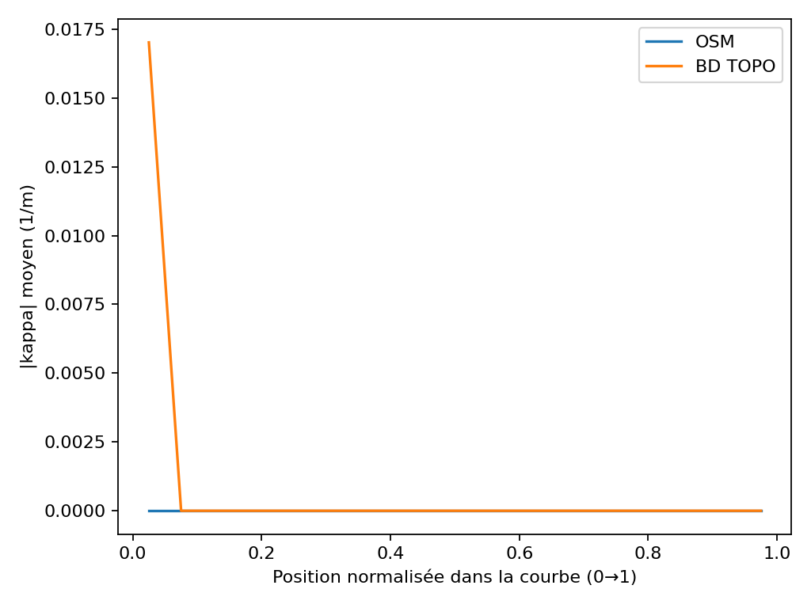

# Courbure — Analyse des virages

Ce rapport se concentre sur les courbes détectées (séquences à forte courbure/faible rayon) et leur comparaison OSM vs BD TOPO.

## Indicateurs clés (KPIs)

|                |   count |          mean |        median |          std |          q25 |           q75 |          iqr |
|:---------------|--------:|--------------:|--------------:|-------------:|-------------:|--------------:|-------------:|
| diff_r_min     |    5677 |   5.08358e+07 |   5.44279e+07 |  1.80566e+07 |   3.7993e+07 |   6.69628e+07 |  2.89698e+07 |
| diff_kappa_max |    5677 |  -0.0209203   |  -0.0167141   |  0.0160313   |  -0.0301382  |  -0.00818493  |  0.0219532   |
| alat50_diff    |    5677 |  -7.32115     |  -6.74745     |  4.28331     | -12.8601     |  -3.34716     |  9.5129      |
| alat80_diff    |    5677 | -18.7422      | -17.2735      | 10.9653      | -32.9218     |  -8.56873     | 24.353       |
| alat110_diff   |    5677 | -35.4344      | -32.6577      | 20.7312      | -62.2427     | -16.2003      | 46.0424      |

## Figures

## Interprétation des résultats

Les indicateurs présentés permettent de comprendre les différences systématiques entre les données OSM et BD TOPO (IGN). Le diff_r_min, représentant la différence de rayon minimal, montre que les rayons issus de l'IGN sont généralement plus grands, ce qui suggère une modélisation plus lissée des virages. Le diff_kappa_max, indiquant la différence de courbure maximale, révèle une tendance d'OSM à présenter des courbures plus fortes, possiblement dues à une segmentation plus fine des trajectoires. Les différences sur les indicateurs alat50_diff, alat80_diff et alat110_diff confirment ces biais systématiques, avec des valeurs négatives indiquant que la courbure moyenne mesurée sur OSM est plus élevée que celle de l'IGN. Ces écarts sont importants car ils impactent la perception de la géométrie des virages et donc les analyses qui en découlent.

## Causes possibles des écarts

- Différences de modélisation : IGN utilise des vecteurs plus lissés tandis qu'OSM présente des segmentations plus brutes et détaillées.
- Granularité géométrique différente entre les deux sources de données.
- Qualité et homogénéité variable des données, avec potentiellement des erreurs ou des approximations différentes.

## Implications pratiques

- Sécurité routière : les écarts peuvent entraîner une surévaluation ou une sous-évaluation des virages, impactant l'analyse des risques.
- Simulation ADAS/autonomie : les différences de courbure influencent les trajectoires simulées et donc la fiabilité des systèmes d'aide à la conduite.
- Études d’infrastructure : une modélisation précise des virages est cruciale pour la conception et la maintenance des routes.

## Perspectives

- Enrichissement des analyses avec des données hybrides combinant OSM et IGN pour bénéficier des avantages de chaque source.
- Intégration de clothoïdes ajustées pour une meilleure représentation géométrique des virages.
- Construction d’un référentiel national de virages pour standardiser les analyses et améliorer la qualité des données.
