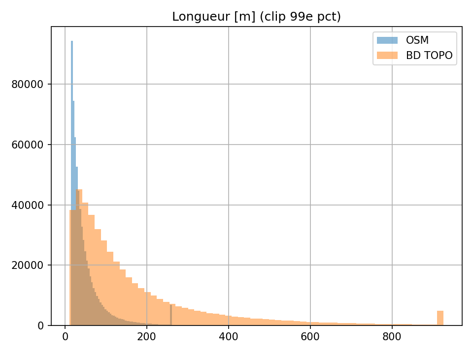
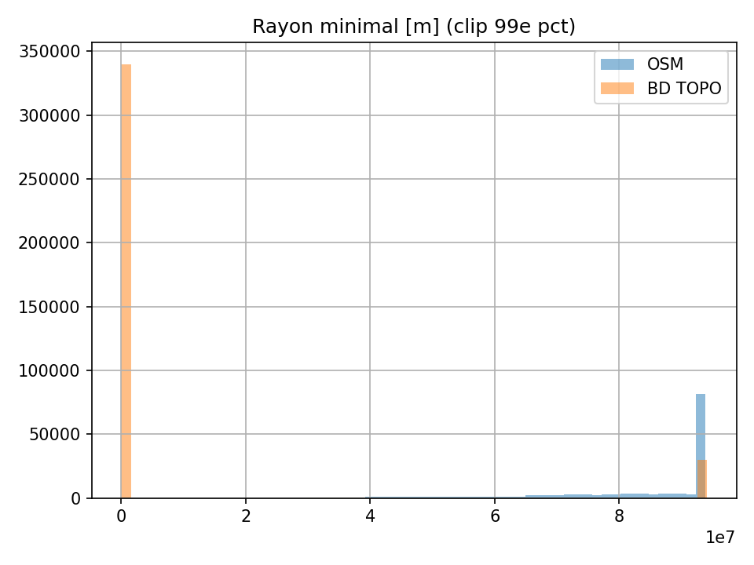
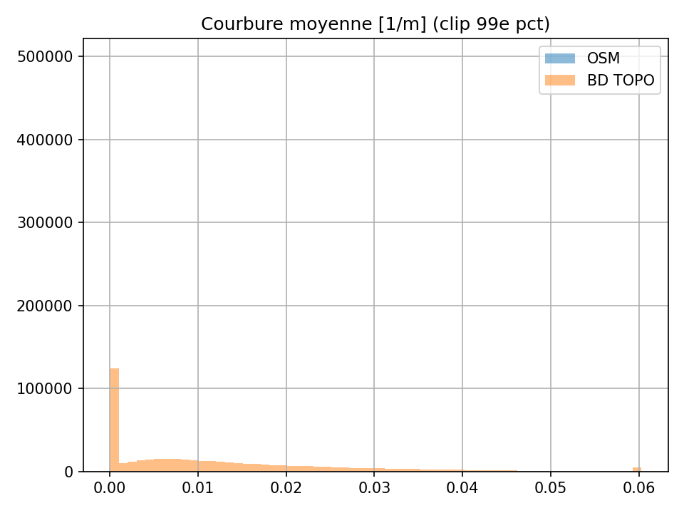

# Résultats

## Comptages et longueurs

| Source  | # segments | Longueur moyenne (m) | Médiane (m) | Somme (km) |
|---------|------------|-----------------------|-------------|------------|
| OSM     | 653 548    | 51,25                | 35,32       | 33 493     |
| BD TOPO | 456 874    | 172,16               | 107,44      | 78 654     |

> OSM est **beaucoup plus segmenté**, ce qui entraîne des longueurs moyennes très faibles.

---

## Distributions globales (clippées à q=0,99)

### Longueurs

### Rayon minimal

### Courbure moyenne

---

## Comparaison par plus proches voisins

| Metric              | count   | mean      | std       | min      | 25%      | 50%      | 75%      | max      |
|---------------------|---------|-----------|-----------|----------|----------|----------|----------|----------|
| diff_length_m       | 653 548 | -158.9 m  | 230.9 m   | -9 933.6 | -207.8   | -80.7    | -21.1    | 2 144.9  |
| diff_radius_min_m   | 138 046 | 7.41e+07  | 4.73e+07  | -5.33e+09| 6.78e+07 | 9.04e+07 | 9.37e+07 | 9.37e+07 |
| diff_curv_mean_1perm| 653 548 | -0.012    | 0.012     | -0.0667  | -0.0171  | -0.0088  | -0.0029  | 3.36e-07 |

- Les longueurs OSM sont en moyenne **159 m plus courtes** que BD TOPO.  
- La courbure est légèrement plus faible côté OSM (segments plus “souples”).  
- Les rayons minimaux montrent des valeurs extrêmes (segments quasi rectilignes).  

---

## Points clés

- OSM **fragmenté** → biais sur les longueurs.  
- BD TOPO **plus précis** → meilleure estimation des rayons.  
- Nécessité d’un **matching par classe routière** pour fiabiliser la comparaison.  