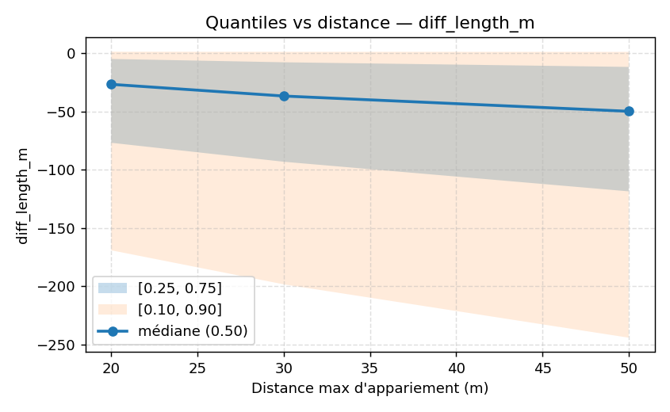

## Couverture des appariements (sans contrainte de classe) 📊

- d = 20 m : 206 264 / 653 548 segments OSM appariés.  
- d = 30 m : 291 090 / 653 548 appariés.  
- d = 50 m : 417 688 / 653 548 appariés.  

## Écarts globaux OSM − BDTOPO (sans contrainte de classe, `--drop-inf`) 📈

### d = 20 m
- **Δ `length_m`** :  
  - moyenne : −62,88 m  
  - médiane : −26,66 m  
  - **OSM plus court** par segment.
- **Δ `curv_mean_1perm`** :  
  - moyenne : −0,01223  
  - **OSM plus « souple » en moyenne**.
- **Δ `radius_min_m`** :  
  - moyenne : 6,88×10^7 m  
  - distribution très étalée, extrêmes présents.

> **Lecture**  
> En augmentant d, le taux d’appariements croît, mais le biais de longueur (**OSM plus court**) s’amplifie et la courbure moyenne reste plus faible côté OSM (segments plus « rectilignes »/simplifiés en moyenne).

### d = 30 m
- **Δ `length_m`** :  
  - moyenne : −75,58 m  
  - médiane : −36,71 m.
- **Δ `curv_mean_1perm`** :  
  - moyenne : −0,01262.
- **Δ `radius_min_m`** :  
  - moyenne : 7,03×10^7 m.

### d = 50 m
- **Δ `length_m`** :  
  - moyenne : −93,86 m  
  - médiane : −49,82 m.
- **Δ `curv_mean_1perm`** :  
  - moyenne : −0,01268.
- **Δ `radius_min_m`** :  
  - moyenne : 7,17×10^7 m.

## Effet de la contrainte de classe (avec `--match-class` `--class-map configs/class_map.yml`) 🎯

- d = 30 m → 9 282 appariements respectant l’égalité de classes normalisées (OSM vs BD, après mapping).
- **Δ `length_m`** :  
  - moyenne : −106,73 m  
  - écart plus marqué que le global.
- **Δ `curv_mean_1perm`** :  
  - moyenne : −0,00662  
  - réduction de l’écart de courbure quand les classes sont homogènes.
- **Δ `radius_min_m`** :  
  - moyenne : 6,59×10^7 m.

> **Lecture**  
> En contraignant les classes, on réduit l’inhomogénéité fonctionnelle entre réseaux, ce qui atténue l’écart sur la courbure moyenne (mais accentue l’écart de longueur par segment — segmentation et modélisation restent différentes).

## Sensibilité à la distance d 🔍

Les quantiles exportés (p. ex. `nearest_quants_d20.csv`, `nearest_quants_d30.csv`, `nearest_quants_d50.csv`) montrent :

- des médianes **Δ `length_m`** toujours < 0 (**OSM plus court**),
- des queues asymétriques (grands négatifs liés à des découpages BDTOPO moins segmentés / tronçons plus longs).

## Fichiers produits (exemples) 📁

- [x] Résumés (sans contrainte) : `nearest_diffs_d20.csv`, `nearest_diffs_d30.csv`, `nearest_diffs_d50.csv`.  
- [x] Quantiles : `nearest_quants_d{20,30,50}.csv`.  
- [x] Contraint classe (d=30 m) : `compare__nearest_diffs.csv`, `compare__nearest_quantiles.csv`, `compare__nearest_matches.csv`, `compare__nearest_byclass.csv`, `compare__nearest_links.gpkg`.  
- [x] Diagnostics classes : `compare__class_stats.csv`.  

## Bandes de quantiles vs distance de rapprochement 📉

  
*Figure : Différence de longueur en fonction de d*

  
*Figure : Différence du rayon minimum en fonction de d*

  
*Figure : Différence de la courbure moyenne en fonction de d*

## Implications produit et marché 🚀

Les résultats de comparaison OSM vs BD TOPO renforcent la valeur du simulateur **RoadSimulator3**, car ils illustrent comment l’outil permet de quantifier objectivement les écarts entre différentes bases de données de référence. Cette capacité à mesurer et analyser les différences structurelles entre réseaux routiers apporte un support concret à la validation, à l’alignement et à l’amélioration des données cartographiques utilisées dans de nombreux domaines.

Ces analyses sont cohérentes avec le discours exposé dans le document *[Elevator Speech - RoadSimulator3.pdf]*(Elevator%20Speech%20-%20RoadSimulator3.pdf) (simulateur inertiel réaliste, fusion GPS/IMU, génération de trajectoires synthétiques à 10 Hz), ainsi qu’avec le *[Business Model Canvas]*(https://en.wikipedia.org/wiki/Business_Model_Canvas) (création de valeur pour les assureurs, constructeurs automobiles et smart cities).

**Applications directes :**

- Validation et alignement de bases cartographiques hétérogènes (OSM, BD TOPO, autres).  
- Génération de jeux de données synthétiques pour entraîner des algorithmes de navigation.  
- Benchmark indépendant pour assureurs, collectivités, start-ups mobilité.  
- Support scientifique pour publications et communication.