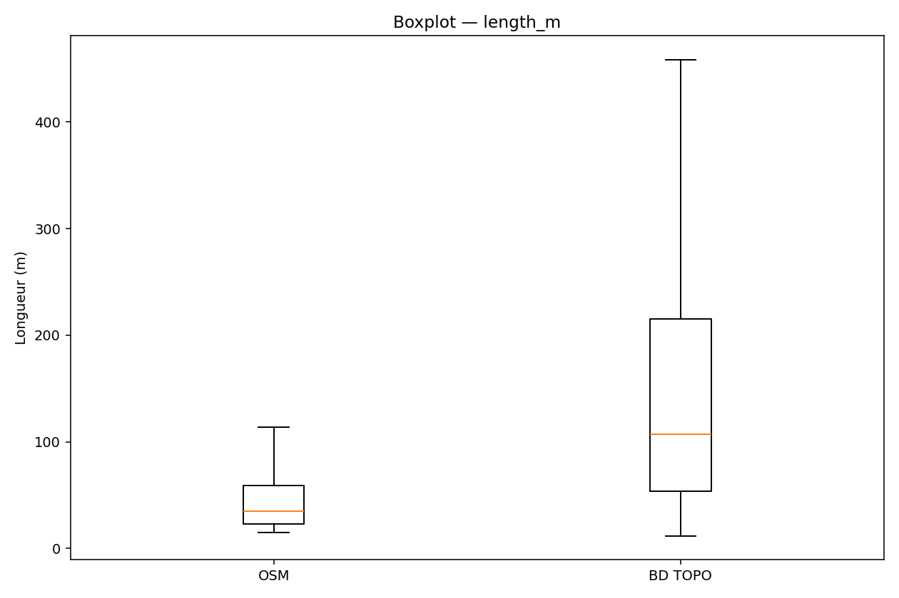

# Table des matières

- [Table des matières](#table-des-matières)
- [Couverture des appariements sans contrainte de classe 📊](#couverture-des-appariements-sans-contrainte-de-classe-)
- [Écarts globaux OSM − BDTOPO sans contrainte de classe (`--drop-inf`) 📈](#écarts-globaux-osm--bdtopo-sans-contrainte-de-classe---drop-inf-)
  - [Résumé des écarts par distance](#résumé-des-écarts-par-distance)
    - [Synthèse](#synthèse)
      - [Forces](#forces)
      - [Limites](#limites)
- [Effet de la contrainte de classe avec `--match-class` et `--class-map` 🎯](#effet-de-la-contrainte-de-classe-avec---match-class-et---class-map-)
    - [Synthèse](#synthèse-1)
      - [Forces](#forces-1)
      - [Limites](#limites-1)
- [Sensibilité à la distance d 🔍](#sensibilité-à-la-distance-d-)
- [Fichiers produits (exemples) 📁](#fichiers-produits-exemples-)
- [Bandes de quantiles selon la distance de rapprochement 📉](#bandes-de-quantiles-selon-la-distance-de-rapprochement-)
- [Implications produit et marché 🚀](#implications-produit-et-marché-)
    - [Applications directes](#applications-directes)
    - [Documents associés](#documents-associés)
- [Résultats statistiques globaux 📊](#résultats-statistiques-globaux-)
- [Distributions globales 📈](#distributions-globales-)
- [Résultats par classe 🛣️](#résultats-par-classe-️)
- [Bias sweep (distance max d’appariement) 🔍](#bias-sweep-distance-max-dappariement-)
- [Perspectives](#perspectives)

---

# Couverture des appariements sans contrainte de classe 📊

| Distance (m) | Nombre d’appariements | Total segments OSM |
|-------------:|---------------------:|-------------------:|
|          20  |              206 264 |           653 548  |
|          30  |              291 090 |           653 548  |
|          50  |              417 688 |           653 548  |

---

# Écarts globaux OSM − BDTOPO sans contrainte de classe (`--drop-inf`) 📈

## Résumé des écarts par distance

| Distance (m) | Δ longueur moyenne (m) | Δ longueur médiane (m) | Δ courbure moyenne (1/m) | Δ rayon minimal moyen (×10^7 m) |
|-------------:|-----------------------:|-----------------------:|-------------------------:|-------------------------------:|
|          20  |                −62,88  |                −26,66  |                 −0,01223 |                          6,88  |
|          30  |                −75,58  |                −36,71  |                 −0,01262 |                          7,03  |
|          50  |                −93,86  |                −49,82  |                 −0,01268 |                          7,17  |

### Synthèse

L’augmentation de la distance d’appariement conduit à une couverture plus importante des segments, ce qui est bénéfique pour une analyse exhaustive. Toutefois, cette extension s’accompagne d’un biais croissant sur la longueur, avec des segments OSM systématiquement plus courts que ceux de BDTOPO. Par ailleurs, la diminution de la courbure moyenne observée côté OSM suggère une simplification ou une tendance à la linéarité accrue des segments appariés. Ces phénomènes doivent être pris en compte dans l’interprétation des résultats pour éviter des conclusions erronées.

#### Forces

- Augmentation significative du nombre d’appariements, améliorant la représentativité des analyses.
- Mise en évidence claire des différences structurelles entre les bases de données.

#### Limites

- Biais croissant sur la longueur, limitant la comparabilité directe.
- Simplification apparente des segments OSM pouvant masquer des variations fines.

---

# Effet de la contrainte de classe avec `--match-class` et `--class-map` 🎯

| Indicateur            | Moyenne          |
|----------------------|-----------------:|
| Nombre d’appariements |           9 282  |
| Δ longueur (m)        |      −106,73     |
| Δ courbure moyenne    |       −0,00662   |
| Δ rayon minimal (×10^7 m) |      6,59     |

### Synthèse

L’introduction d’une contrainte de classe dans l’appariement améliore la cohérence fonctionnelle entre les réseaux routiers comparés, ce qui se traduit par une réduction notable de l’écart de courbure moyenne. En revanche, cette contrainte accentue le biais sur la longueur, probablement en raison des différences dans la segmentation et la modélisation propres à chaque classe de route. Ce compromis souligne l’importance de choisir judicieusement les paramètres d’appariement selon l’objectif de l’étude.

#### Forces

- Amélioration de l’homogénéité fonctionnelle des segments appariés.
- Réduction de l’écart de courbure moyenne, renforçant la pertinence des comparaisons.

#### Limites

- Biais accru sur la longueur, potentiellement limitant l’analyse quantitative.
- Réduction du nombre d’appariements, ce qui peut affecter la robustesse statistique.

---

# Sensibilité à la distance d 🔍

Les fichiers de quantiles générés (*nearest_quants_d20.csv*, *nearest_quants_d30.csv*, *nearest_quants_d50.csv*) montrent que :

- Les médianes de Δ longueur sont toujours négatives (OSM plus court).
- Les distributions présentent des queues asymétriques, avec des valeurs négatives importantes dues à des découpages BDTOPO moins segmentés.
- Le nombre d’appariements augmente avec la distance d (de 206 264 à 417 688).
- Les quantiles utilisés sont 0.10, 0.25, 0.50, 0.75 et 0.90, configurables selon les besoins, offrant une meilleure granularité dans l’interprétation.

---

# Fichiers produits (exemples) 📁

- [x] Résumés (sans contrainte) : *nearest_diffs_d20.csv*, *nearest_diffs_d30.csv*, *nearest_diffs_d50.csv*
- [x] Quantiles : *nearest_quants_d{20,30,50}.csv*
- [x] Contraintes de classe (d=30 m) : *compare__nearest_diffs.csv*, *compare__nearest_quantiles.csv*, *compare__nearest_matches.csv*, *compare__nearest_byclass.csv*, *compare__nearest_links.gpkg*
- [x] Diagnostics classes : *compare__class_stats.csv*

---

# Bandes de quantiles selon la distance de rapprochement 📉

*Figure 1 : Différence de longueur*

*Figure 2 : Différence du rayon minimal*

*Figure 3 : Différence de la courbure moyenne*

---

# Implications produit et marché 🚀

Les résultats renforcent la valeur du simulateur **RoadSimulator3**, illustrant sa capacité à quantifier objectivement les écarts entre bases de données routières. Cette analyse structurelle soutient la validation, l’alignement et l’amélioration des données cartographiques utilisées dans de nombreux secteurs.

### Applications directes

- Validation et alignement de bases cartographiques hétérogènes (OSM, BD TOPO, autres)
- Génération de jeux de données synthétiques pour entraîner des algorithmes de navigation
- Benchmark indépendant pour assureurs, collectivités et start-ups mobilité
- Support scientifique pour publications et communications

### Documents associés

- *Elevator Speech - RoadSimulator3.pdf* : simulateur inertiel réaliste, fusion GPS/IMU, génération de trajectoires synthétiques à 10 Hz
- *Business Model Canvas* : création de valeur pour assureurs, constructeurs et smart cities

---

# Résultats statistiques globaux 📊

Les tests statistiques (Welch t-test, Kolmogorov–Smirnov, Mann–Whitney) ont été appliqués aux métriques principales.

| Metric      | n_osm   | n_bd    | mean_osm | mean_bd | std_osm | std_bd | diff_mean | t_welch | p_t_welch | ks_stat | p_ks | mw_stat | p_mw | cohens_d | cliffs_delta |
|-------------|--------:|--------:|---------:|--------:|--------:|-------:|----------:|--------:|----------:|--------:|-----:|--------:|-----:|---------:|-------------:|
| length_m    | 456 874 | 456 874 | 51.93    | 172.16  | 53.57   | 199.54 | −120.23   | −393.34 | 0.0       | 0.465   | 0.0  | 4.20e10  | 0.0  | −0.82    | −0.60        |

*Tableau 1 : Exemple de résultats statistiques globaux.*

---

# Distributions globales 📈

*Figure 4 : Distribution des longueurs (OSM vs BD TOPO).*

*Figure 5 : Boxplot des longueurs.*

---

# Résultats par classe 🛣️

Les distributions et statistiques sont également produites par classe normalisée de route. Cette stratification permet d’identifier des comportements spécifiques selon la catégorie fonctionnelle des routes.

Exemple détaillé :

- **Motorway** : segments généralement longs, avec une courbure faible et une forte homogénéité entre OSM et BDTOPO. Les écarts de longueur sont modérés, reflétant une bonne correspondance des tronçons principaux.
- **Primary** : segments plus courts et plus sinueux, avec des écarts plus marqués sur la longueur et la courbure, probablement liés à une segmentation plus fine ou à des différences dans la modélisation des routes secondaires.

Ces observations sont détaillées dans le **Rapport par classe** : [reports/curvature_by_class.md](reports/curvature_by_class.md), qui présente toutes les figures et analyses par catégorie de route.

---

# Bias sweep (distance max d’appariement) 🔍

Les analyses de sensibilité montrent l’effet de la distance max sur les écarts observés.

*Figure 7 : Bias sweep — longueur.*

*Figure 8 : Bias sweep — rayon minimal.*

*Figure 9 : Bias sweep — courbure.*

---

# Perspectives

Pour les prochaines étapes, plusieurs pistes sont envisagées afin de renforcer et d’étendre cette analyse :

1. **Constitution d’un référentiel de virages hybride OSM/IGN**
   Combiner les forces des deux bases de données pour créer un référentiel de virages plus complet et fiable, facilitant les études de courbure et de sécurité routière.

2. **Intégration dans RoadSimulator3 comme benchmark reproductible**
   Incorporer ces analyses dans le simulateur RS3 pour permettre des évaluations standardisées et reproductibles des données routières, améliorant ainsi la qualité des simulations.

3. **Ouverture vers des publications scientifiques**
   Valoriser ces travaux par des publications dans des revues et conférences spécialisées, contribuant à la communauté scientifique et favorisant les collaborations interdisciplinaires.

Ces perspectives visent à consolider la robustesse méthodologique et à maximiser l’impact applicatif des résultats obtenus.
