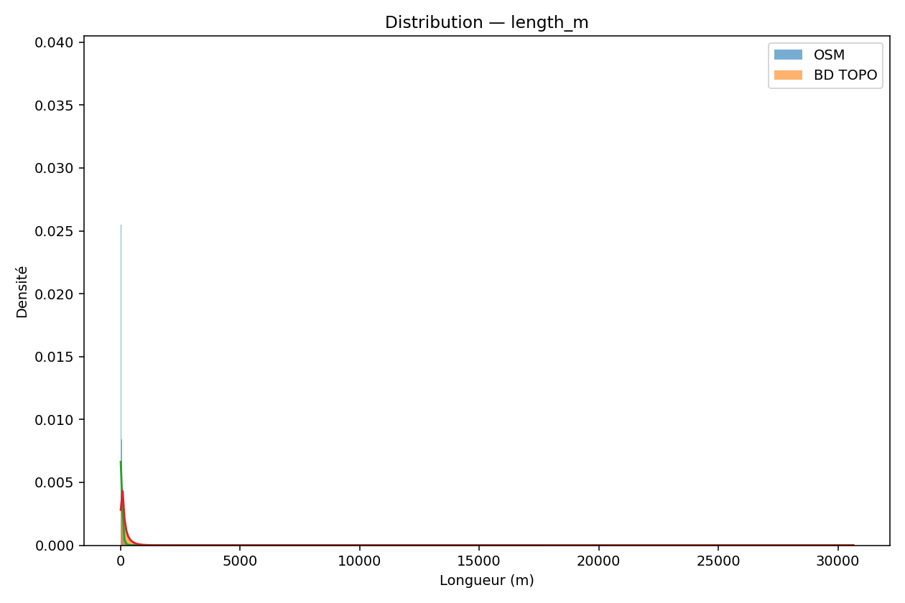
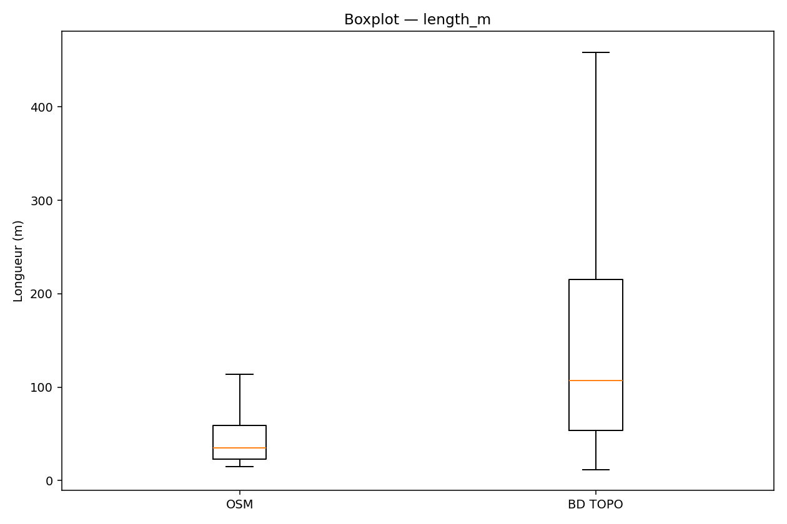
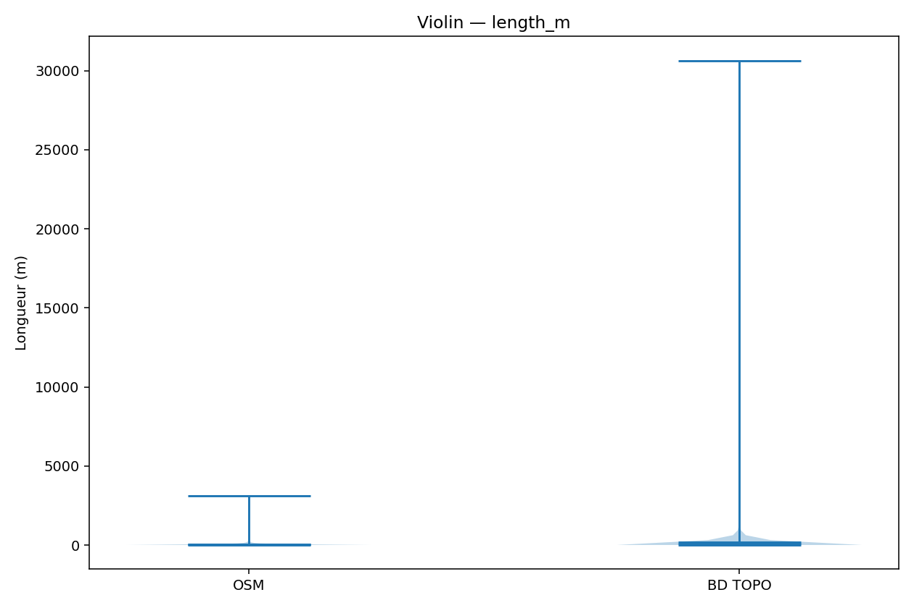

# Rapport comparatif OSM vs BD TOPO

_Généré automatiquement le 2025-09-22 10:31:00_

## Points saillants
- **length_m** : effet fort (Cohen d=-0.82), KS=0.465, Δmoy=-120.226 ↓

## Résultats statistiques globaux

| metric   |   n_osm |   n_bd |   mean_osm |   mean_bd |   diff_mean |   t_welch |   p_t_welch |   ks_stat |   p_ks |     mw_stat |   p_mw |   cohens_d |   cliffs_delta |
|:---------|--------:|-------:|-----------:|----------:|------------:|----------:|------------:|----------:|-------:|------------:|-------:|-----------:|---------------:|
| length_m |  456874 | 456874 |    51.9304 |   172.157 |    -120.226 |  -393.335 |           0 |  0.465397 |      0 | 4.20483e+10 |      0 |  -0.822962 |      -0.597111 |

## Distributions graphiques

### Longueur (m)

